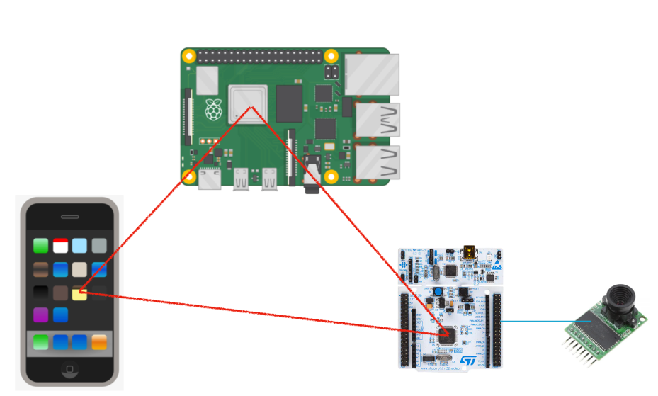

# Project Proposal

## 1. Motivation & Objective

Detecting moving objects locally uses a low energy embedded system camera. Apply machine learning perception locally in embedded systems to recognize objects (human, pets etc). Send data to the server for more complex analysis (face detection, action analysis. Send notifications to a portable device (phone). Portable device should be able to control the embedded device or the host server. Functions include turn one the system, turn off system, low energy mode. 

## 2. State of the Art & Its Limitations

There are existing devices in the market, but most of them solely depend on their built-in chip to perform machine learning algorithms. The cost of the device will naturally increase when forced to put in a high end chip inside every camera module instead of using one central server for heavy computation. 

## 3. Novelty & Rationale

My approach includes a low energy controller connected to the camera, the controller controls the camera and performs simple tasks. The algorithm running on the microcontroller will decide whether to send an image to the central server for heavy tasks.In this case, camera module can be built with a cheaper price. 

## 4. Potential Impact

The project connects the camera, microcontroller, central server and portable device together. It provides a different approach to home security systems, cameras can be built with low price and more powerful computational power can be obtained using the central server. Broadly speaking, it introduce LOT in home secuity system, and can be extend to any other electronical device require large amount comuptation in home. 

## 5. Challenges
 
The main challenges of the project include modified camera driver for stm32 microcontroller, communication between microcontroller and central server, and communication between server and phone. Other challenges include machine learning on embedded devices, energy efficiency optimization. If time is allowed in the end, I will rewrite the camera driver using STM32 HAL instead of the current standard peripheral library which only supports a limited number of STM32 microcontrollers. 

## 6. Requirements for Success

* Computer vision algorithm
* Machine learning on embedded device
* Embedded C programming and debugging on STM32
* Arm-gcc-none-eabi tool chain 
* Apply RTOS on embedded device to handle different tasks. 
* Communication protocal 
* Microcontroller
* SPI camera
* Phone

## 7. Metrics of Success

The camera should be able to detect moving objects and decide whether the object is human or not, the recall of the system should be higher than 95%. The central server should be able to perform fast machine learning perceptron, detect the face with precision higher than 90% in real-time processing.

## 8. Execution Plan
The exection plan is divided in to three main section.

* STM32 Embedded Borad
	* Control camera use USART port, read captured image in JPEG format use SPI interface
	* Detect and locate the moving object captured by camera
	* Apply ML inference to classify moving object
	* Send captured image to host server for detail analysis
	* Receive instruction from the  host server raspberry pi or portable device

* Raspberry Pi Host Server
	* Receive image from the STM32 device, apply heavy duty ML task
	* Face detection, detect if the person is admin. 
	* Action classification 
		* Talking, Walking etc
	* Send notifications to portable device
		* Capture image
		* Result of ML analysis
	* Receive instruction from portable device
		* Turn on/off system
		* Different mode

* Potable Device
	* Receive notification from host server
	* Send instruction to the host server

## 9. Related Work

### 9.a. Papers

* Human detection in surveillance videos and its applications - a review <cite>[Manoranjan & Shah][1]</cite>

Introduce multiple methods for human detection, provide comparison and implementation details for different models. This project  will include a model based on this paper use STM32 Microcontroller for human detection. 

* Deeply learned face representations are sparse, selective, and robust <cite>[Yi & Xiaogang][2]</cite>

Provide an accuracy model for robust face recognition. This model will be implemented on the central server.  

### 9.b. Datasets

* Labelled Faces in the Wild Home (LFW)<cite>[Gary][3]</cite>

* COCO Dataset <cite>[Tsung-Yi][4]</cite>

### 9.c. Software

* Arm-gcc-none-eabi <cite>[5]</cite>
* Tensorflow-lite <cite>[Gary][6]</cite>

## 10. References

[1]  Paul, M., Haque, S.M.E. & Chakraborty, S. Human detection in surveillance videos and its applications - a review. EURASIP J. Adv. Signal Process. 2013, 176 (2013). https://doi.org/10.1186/1687-6180-2013-176

[2] Yi Sun, Xiaogang Wang, Xiaoou Tang: “Deeply learned face representations are sparse, selective, and robust”, 2014;http://arxiv.org/abs/1412.1265 arXiv:1412.1265.

[3]Gary B. Huang, Manu Ramesh, Tamara Berg, and Erik Learned-Miller.
Labeled Faces in the Wild: A Database for Studying Face Recognition in Unconstrained Environments. University of Massachusetts, Amherst, Technical Report 07-49, October, 2007.

[4] Tsung-Yi Lin, Michael Maire, Serge Belongie, Lubomir Bourdev, Ross Girshick, James Hays, Pietro Perona, Deva Ramanan, C. Lawrence Zitnick, Piotr Dollár: “Microsoft COCO: Common Objects in Context”, 2014; 

[5] Arm-gcc-none-eabi [software],open-source suite of tools for C, C++ and assembly programming. 

[6] Tensorlow-lite [software],Large-scale machine learning on heterogeneous systems,
2015. Software available from tensorflow.org.
