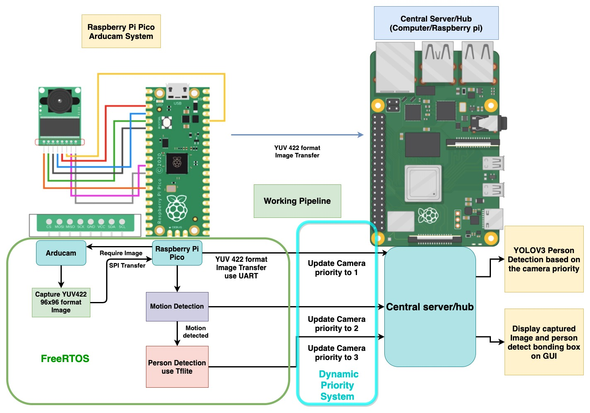
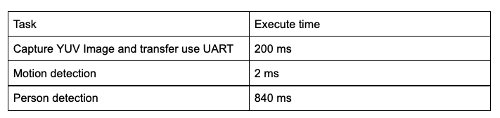
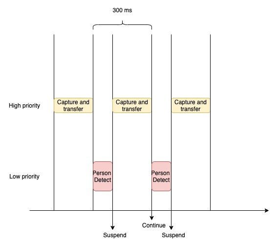
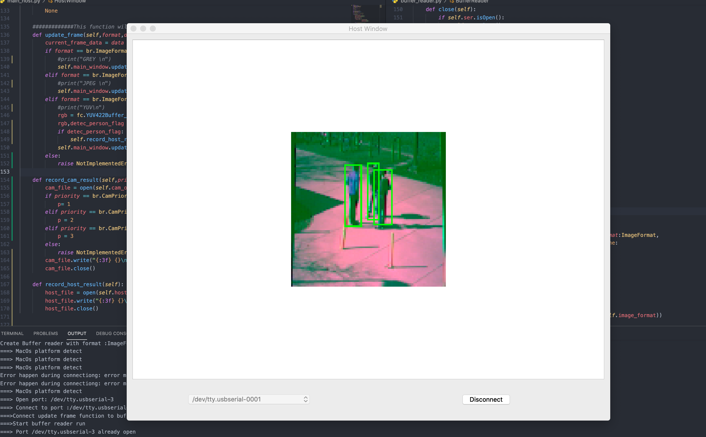
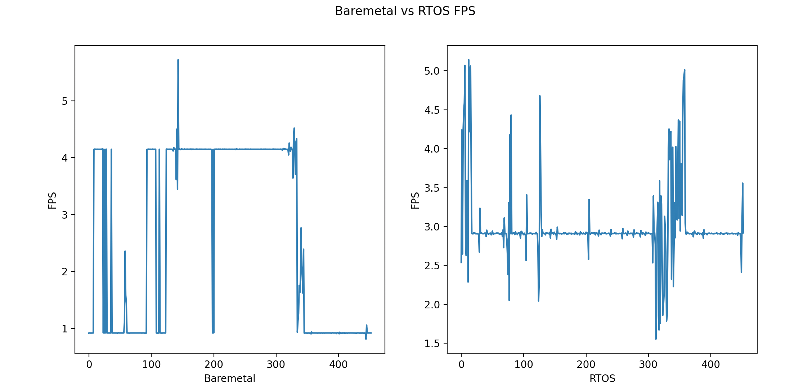
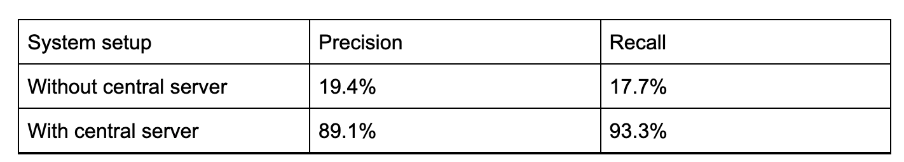
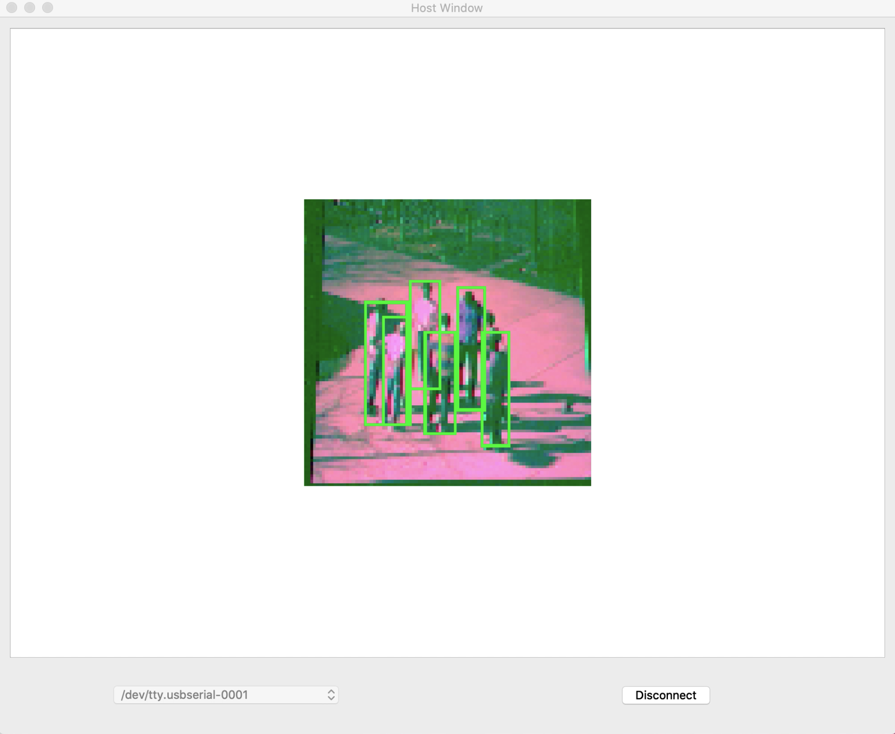

# ECE200 Project -- Central Server Based Smart Camera System

- [ECE200 Project -- Central Server Based Smart Camera System](#ece200-project----central-server-based-smart-camera-system)
- [Abstract](#abstract)
- [1. Introduction](#1-introduction)
- [2. Related Work](#2-related-work)
- [3. Technical Approach](#3-technical-approach)
  - [3.1 Raspberry Pi Pico Arducam System](#31-raspberry-pi-pico-arducam-system)
  - [3.2 Dynamic Priority System](#32-dynamic-priority-system)
  - [3.3 Central Server](#33-central-server)
- [4. Evaluation and Results](#4-evaluation-and-results)
- [5. Discussion and Conclusions](#5-discussion-and-conclusions)
- [6. References](#6-references)

# Abstract
This project discovered the feasibility and potential for a central server based smart camera system. The smart camera module alone is able to perform light weight tasks including motion detection and simple person detection using a neural network. The central server running on a PC or Raspberry Pi is able to handle heavy duty tasks such as more advanced and accurate person detection and semantic segmentation, as well as render the GUI. Tasks inside the  smart camera are scheduled to use FreeRTOS, this ensures that the central server will have stable image input while the smart camera performs person detection. The motion detection and person detection result calculated in edge AI devices is transferred to the central server, those results act as a guidance for camera priority. Central serval will first process the camera data with higher priority. This design ensures that the central server will be optimally efficient when multiple cameras connect to it. The system is tested on a 16 mins video and achieve 91% precision on person with the help of the central server. 

# 1. Introduction
With the fast development of machine learning model compression and edge device AI framework, it is practical to deploy machine learning programmes to edge devices, more and more electronic devices are able to become smart devices. One of the most important areas is smart cameras. Smart cameras can be widely used in personal home security, warehouse security or factory assembly line monitoring. Currently, most of the smart cameras in the market use their onboard chip for AI computation. Although those smart cameras have fast WIFI connection and are able to connect to smartphones or computers, their entire computation is limited by their on board microcontroller.  Such design leads to several potential problems. First, most of those cameras can only run simple person detection neural networks due to the limited computational power and ram. Most of the high performance neural network requires hundreds of MB’s to store the model and fast GPU to inference the model which is unlikely to be available on smart camera due to the cost and physical size of the camera.  Second, it’s impractical to update such a smart camera because most of the time the camera module is good enough for many years, but new machine learning algorithms update fast, and would require more computational power in general. Updating such a smart camera for new AI performance would require replacing the entire module. 

Despite those problems, I do believe that the edge device AI has it’s irreplaceable role in smart devices. With the large bandwidth provided by 5G and WIFI, it is easy to transfer data from the edge device to a central hub or server for large computation. But that does not mean the edge device is only transmitting dataout, in fact, their computation ability can work tightly with the central server to reduce the pressure of the server. Furthermore, in a central server based smart camera system, the edge AI can provide baseline functions to prevent sudden shutdown of the server, especially when using a cloud central server. 

The goal of this project is to design a central server based camera system but meanwhile maximize the usage of the edge device AI computation resource. The project includes two modules, the smart camera module and the central server module. The smart camera transfers the captured image to the central server and meanwhile processes the image to detect if there is motion and person in the captured image. The central serval has a GUI to display the captured video to the user. Due to the limit of microcontrollers inside the smart camera module, the person detection accuracy and  robustness are limited. Thus the central server will run an advanced neural network for person detection. A Dynamic priority system is implemented to integrate edge AI I and the central server. The motion and person detection computed inside the smart camera model will be sent to central serval. Central serval will change the priority of the camera based on those results, the purpose of the system is to use edge AI to increase the efficiency of the central server, reduce the cost on those servers, especially when multiple cameras are connected to the server. 

Challenges of this project include design pipeline for the smart camera system, taks schedule inside the embedded system. How to make the camera transfer image to the central server while performing neural network inference and how to make the smart camera work tightly with the central server are important tasks in this project.The main hardware of this project includes two Raspberry Pi Pico, one is used for the smart camera system and another one is used as a programmer to program and debug the other Pico. One Arducam used to capture images and one MacBook and Raspberry Pi 3B+ used as a central server connected to Raspberry Pi Pico serial port via TTL USB adapter. One the software side, the entire program uses C and C++ with the GNU compiler.  The software build system is CMake, and uses FreeRTOS as the real time operating system. The program also uses neural networks in both the camera module and the central server. In the Pico, the neural network is implemented  using Tensorflow lite, in the central server, the neural network is implemented based on Pytorch. 

The success of the project will be evaluated on the accuracy of the system's person detection. Also, the performance improvement of the system with the central server and RTOS in various ways. 

# 2. Related Work

The edge AI has been a popular topic for the last few years and seems like it’s becoming an even more important topic in both research and application. Tensorflow is one of the most popular neural network frameworks, and it provides a lite version for  edge devices called Tensorflow lite (TFlite) <cite>[Tflite][1]</cite>. 

Object detection is under fast iteration and improvement recently, most of the success methods rely on neural networks. There are light weight models like Mobilenet <cite>[Howard][2]</cite> that aim to reduce the size and inference time of the neural network model.  Relatively complex but powerful network YOLO <cite>[Redmon][3]</cite> is not only used to detect objects but also perform semantic segmentation.

Although most microcontrollers do not support multi-threading like CPU, there's a real-time operating system (RTOS) that allows task concurrency inside the microcontroller. FreeRTOS is a widely used light weight RTOS that has low overhead <cite>[Tao][4]</cite> in task scheduling and good portability.

# 3. Technical Approach

Above graph shows the hardware and the working pipeline of the system. The Arducam and the Raspberry Pi pico can be treated as a smart camera system with limited built-in AI capability and the Raspberry Pi or the computer served as a central server in this project. The Arducam will capture the image in YUV422 format (YUVU) and transfer it to Pico through SPI interface. The Pico will perform motion detection and if it detects motion then persone detection using TFlite will be triggered. All those tasks are scheduled using the Real Time Operating System (RTOS) called FreeRTOS. The details of the implementation will be mentioned in the next section. 

Although I only have one camera module available for this project, the system is actually optimized for **multi-camera** systems. Inspired by the FreeRTOS’s task priority system, I designed a dynamic priority system. The priority queue system will continuously update each camera’s priority based on the computational result inside the Pico and the result from the central server. The camera with higher priory will have their data process first in the central server. The implementation detail will be mentioned later in the priority system section.

## 3.1 Raspberry Pi Pico Arducam System
The purpose of the Pico Arducam system is to first capture the image and transfer it to the central server. After the image is transferred, the Pico will perform motion detection. The implementation of the motion detection is simple yet efficient. A frame difference is computed after every new image captured, this is simply done by applying pixel-wise subtraction between current frame and previou frame. Then instead of applying complex operations like conturor find,I simply find the number of pixels with value above a certain preset threshold. If the number of those pixels are greater than 2 percent of the total pixels in the image, then consider that there is motion between two frames. The reason for such a simple design is because the motion detection will take place after every image capture, so it needs to be fast. In Fact the entire motion detection only takes 2ms in the Pico. 
After the motion detection, if there is no motion detected, then take the next capture. If there is motion, then perform person detection using TFlite. The TFlite model is MobileNetV1 and is quantized to int8. The model can be directly downloaded from the TFlite repository. Despite the logic of the tasks being clear, the system is not practical if simply building the pipeline with bare metal programming. The tabel here includes each task’s execution time.

As we can see, the execution time of the person detection neural network talks about 0.8 seconds. With all other tasks, if there’s motion then the image will update at 1.1 second per frame. This is obviously  not acceptable in a smart camera system. Worth to noticed that, because I’m using UART to transfer the image from Pico to the central server, the image transfer takes about 200ms. In the real application case, the bandwidth between the central server and the smart camera will be way faster than this, most of the smart cameras now support 1080p at 30 or 60 fps through WIFI. However, most of the microcontroller does not have much improvement in the neural network inference speed. So the bare metal programming like this will largely slow down the refresh rate of the smart camera. The solution for this problem is to use RTOS. 
The RTOS I use in this project is FreeRTOS. The FreeRTOS will suspend the tasks with lower priority and execute the high priority task first, then if the time allows, it will continue to execute the lower priority task. In the Pico, the capture image and transfer to the central server has highest priority, because the motion detection only takes about 2ms, I make it first priority too. I set those tasks to execute every 300 ms so that the lower priority person detection task can have time to execute. Below is the graph showing the schedule of each task. 

As a result the host server now refreshes at 3.1 FPS instead of lower than one compared to the bare metal programme, triple the refresh rate. Note that even without adding any other function, the camera can only update at 5 FPS when using YUV422 format under UART connection due to the 200 ms transmit overhead. In the real applicant case, the overhead for image transfer is much smaller than 200ms, this makes much more time for the neural network inference task. 

## 3.2 Dynamic Priority System
Imagine that the smart cameras are used in the warehouse, there are more than 20 of those cameras that keep sending images to the central server and the server needs to process them in real-time. In this project one of the central servers I use is my Macbook pro with Intel's i5 chip. I’m running YOLOV3 on Pytorch with low resolution 128, and it tooks 0.3 second to process one image. It will take 6 second to process one frame from those 20 cameras. Of course, in real applications, we can use GPU and process multiple images in a batch, but my point here is that the central server could have large pressure when running a complex neural network when multiple cameras connect to it. Multiple camera systems are very common nowadays even in home security systems.

If there are multiple cameras connected to the central server, to satisfy all the computation needs, one choice is to make the central server power enough to handle all cameras’ needs. However, such design leads to better hardware in the central server or higher cost for cloud servers. To address this problem I developed a dynamic priority system. The priority system is inspired from the FreeRTOS’s priority task scheduler. The central server will first process images for the camera with higher priority. Below I will introduce how the camra’s priority is classified and decided. 

The camera has 3 priority, the default and the lowest priority is 1. All cameras start with priority 1, if the Pico detects motion, then the camera’s priority changes to 2. If the Pico detects the person, then the camera priority will increase to 3. Each time Pico changes the priority of the camera, it will transmit this information to the host server, so the host server is aware of the priority of the camera. Due to the relatively low accuracy of the Pico system, the Pico can only increase the camera’s priority, not decrease. The central server will process the camera with higher priority, if the host detects the person in the camera’s image, then the camera’s priority increases to 3 if not already. If there’s no person to detect for 1 second, then the camera’s priority decreases to 1. So the host server can both increase and decrease the priority of the camera. Also, to prevent that one camera is not being processed by the central server for a long time due to other cameras’ high priority, if a camera has not been processed for 3 seconds, the central server will increase it’s priority by 1 level.

## 3.3 Central Server

In this project the central server’s job is to run a more advanced person detection neural network, here I choose YOLOV3. Other tasks of the central server are to receive data from the camera and adjust the camera’s priority accordingly, the detailed implementation is explained early in the priority queue system. The central server does provide GUI written in PyQT and the neural network is implemented using Pytorch(citation) and uses a pre-trained model . Below is the screenshot of the GUI of the central server.

# 4. Evaluation and Results

The smart camera system is evaluated in multiple ways with different baseline. Include video refresh rate, person detection accuracy and person detection accuracy under multiple camera simulation. The way I test the camera system is to play a surveillance video in front of the camera and use the central server to record the test data. surveillance videos are from the VIRAT [citation] dataset which is a video dataset of surveillance domain. 

First I evaluate the video refresh rate on the central server, the baseline implementation is smart camera system with **bare metal** implementation and compare with the **RTOS** implementation. Below the graph shows the FPS for those two implementations and tested on an 8 mins video. From the plot we can see that when there’s no motion detected, no person detection is executed, the FPS of the baremetal implementation has 4 FPS, which is the highest possible FPS using the Arducam in YUV422 format. However, when there’s motion in the graph, the FPS drops to below 1, which is not practical in the real-word application. The high FPS is useless when there is no motion in the video, because the server will just receive repeat images. The RTOS implementation has 3 FPS most of the time with or without motion detected. This advantage will be further enhanced when the image transmit overhead is smaller because the difference between the neural network overhead will be much larger then image transmit overhead. 

Second I test the person to detect accuracy on the camera system with and without a central server. During the experiment I noticed that the accuracy of the person detection on Pico has significantly decreased when the person inside the image is far away. I think this is due to the low capacity of the 120KB model. Also with the relatively simple structure of the model, the accuracy decreases a lot when there are multiple people inside the scene. So in order to make this a fair test, instead of using the entire video, I crop a square area from the video, so that the person looks larger when the camera captures the image. 

I tested on a 16 mins video, recorded both the person detection result from the Pico board and the result from the central server. I compare them with the ground truth and the result is shown in the table below. 

From the result we can see that the accuracy of person detection increases significantly with the help of the central server. Also with the central server, the system is able to handle harder tasks. In this project, the central server uses YOLOV3 to perform semantic segmentation.  

# 5. Discussion and Conclusions

This project aims to build a smart camera system with edge AI for lightweight tasks and central server/hub for heavy duty neural networks. The introduction of FreeRTOS ensures the image transfer rate from the camera model to the central hub. With the help of a central server, the smart camera system is able to efficiently detect people on the 16 mins test video with 91% precision. Lightweight tasks in smart cameras include motion detection and simple person detection.  Those lightweight tasks adjust the camera’s priority in the central server, give instructions to the central server which camera’s data needs to process first.  This design increases the reliability and efficiency of the smart camera system, allowing the central server to better allocate its resources under high pressure. This system can be easily extended to various tasks such as facial recognition and person action prediction as long as the central server supports those tasks. Commercial products with this design will be easy to upgrade, since the central server can be easy to update, and usually the camera module does not need to update frequently.  Especially, if the central server is a Web server like AWS, it is even more convenient to update. 

The weak point of such design is first the potential security issue. Since all the captured images are transferred to the central server, it is possible that those data leak during the transfer. The possible solution is to simply apply encryption, use OpenSSL during data transfer, and decrypt the data on the central server. Another weak point is that the cost of the system may be higher if there’s only one camera in the system, however, in the case when multiple cameras are needed such as home security system and warehouse security, the cost of the central server can be spreaded. Overall, with the development of cloud server I think this is the future of the smart camera system. 

# 6. References
[1].  Martín Abadi, Ashish Agarwal, Paul Barham, Eugene Brevdo,
Zhifeng Chen, Craig Citro, Greg S. Corrado, Andy Davis,
Jeffrey Dean, Matthieu Devin, Sanjay Ghemawat, Ian Goodfellow,
Andrew Harp, Geoffrey Irving, Michael Isard, Rafal Jozefowicz, Yangqing Jia,
Lukasz Kaiser, Manjunath Kudlur, Josh Levenberg, Dan Mané, Mike Schuster,
Rajat Monga, Sherry Moore, Derek Murray, Chris Olah, Jonathon Shlens,
Benoit Steiner, Ilya Sutskever, Kunal Talwar, Paul Tucker,
Vincent Vanhoucke, Vijay Vasudevan, Fernanda Viégas,
Oriol Vinyals, Pete Warden, Martin Wattenberg, Martin Wicke,
Yuan Yu, and Xiaoqiang Zheng.
TensorFlow: Large-scale machine learning on heterogeneous systems,
2015. Software available from tensorflow.org.

[2]. A. G. Howard, M. Zhu, B. Chen, D. Kalenichenko, W. Wang,T. Weyand, M. Andreetto, and H. Adam.   Mobilenets:  Effi-cient convolutional neural networks for mobile vision appli-cations.CoRR, abs/1704.04861, 2017

[3]J. Redmon, S. Divvala, R. Girshick and A. Farhadi, "You Only Look Once: Unified, Real-Time Object Detection," 2016 IEEE Conference on Computer Vision and Pattern Recognition (CVPR), 2016, pp. 779-788, doi: 10.1109/CVPR.2016.91.

[4] X,Tao Performance benchmarking of
FreeRTOS and its Hardware Abstraction.Technische Universiteit Eindhoven. 11. 2008 